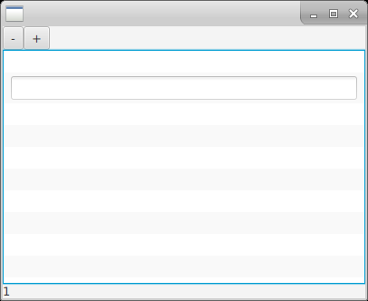
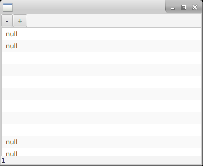

https://bugs.openjdk.java.net/browse/JDK-8220273

# Running

1. mvn clean compile exec:java
2. add 2 items using "+"
3. delete 1 item using "-"
4. double click on row 2

# Results

* with TextFieldListCell enabled

* with TextFieldListCell disabled / commented out

# Conclusions

List items are not updated when removing trailing nulls. See the source code for hard proof.

https://hg.openjdk.java.net/openjfx/9/rt/file/tip/modules/javafx.controls/src/main/java/javafx/scene/control/ListCell.java#l486

TreeCell may need some fixing too.

https://hg.openjdk.java.net/openjfx/9/rt/file/tip/modules/javafx.controls/src/main/java/javafx/scene/control/TreeCell.java#l531

# See also

https://bugs.openjdk.java.net/browse/JDK-8115233 (fixed)

https://hg.openjdk.java.net/openjfx/9/rt/file/tip/modules/javafx.controls/src/main/java/javafx/scene/control/TreeTableCell.java#l626
